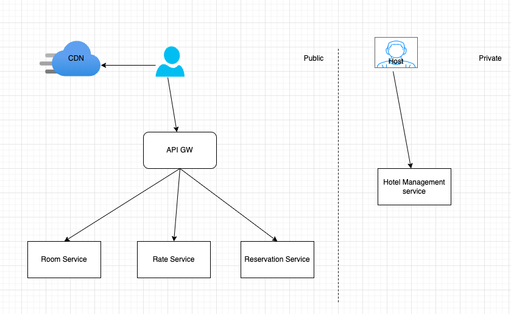

# Hotel Reservation system with .NET Tech stack

## Technologies

- .NET 8
- Entity Framework Core
- PostgreSQL
- FastEndpoint <https://fast-endpoints.com/>
- MediatR <https://github.com/jbogard/MediatR>
- AutoMapper <https://automapper.org/>
- FluentValidation <https://fluentvalidation.net/>
- Swagger <https://swagger.io/>

## Architecture

- Microservices
- CQRS
- Mediator
- DDD

## Functional requirements

## None functional requirements

